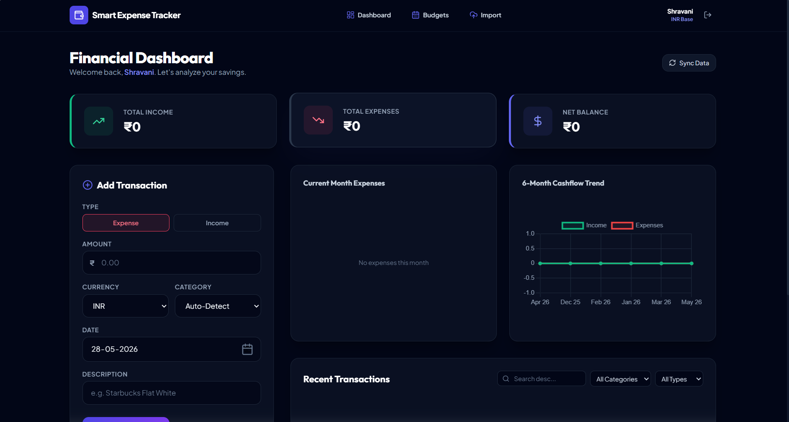

# Smart Expense Tracker Web App

An industry-oriented, full-stack personal finance web application built using the MERN stack. This project functions as a secure, authenticated platform allowing users to monitor cash flows, log incomes and expenses in multiple currencies, set up category-specific budget limits with threshold indicators, and import statements via CSV spreadsheets and image-based receipts (OCR simulation).

---

## 📌 Project Overview
Personal financial management is notoriously tedious, often resulting in unmonitored spending and poor budget adherence. The **Smart Expense Tracker** solves this by providing a unified, visual dashboard that aggregates financial transactions, alerts users before they breach budget caps, auto-categorizes items based on transaction descriptions, and converts foreign currency transactions back into the user's base currency using real-time exchange ratios.

### Target Audiences:
* **Students**: Track allowances, course book expenditures, and check budget warnings.
* **Employees**: Analyze salary allocation and track monthly subscription cycles.
* **Families**: Budget utility bills, groceries, and monitor collective balances.
* **Freelancers**: Separate client invoices from business costs.

---

## 🛠️ Tech Stack (Option B - Intermediate)
* **Frontend**: React.js, Vite (Fast build system), Tailwind CSS (Utility styling), Lucide React (Icon sets)
* **Backend**: Node.js, Express.js (REST API Router), Multer (Multipart file uploads), CSV-Parser (Statement stream ingestion)
* **Database**: MongoDB (NoSQL Document Store), Mongoose (Object-Document Modeling ODM)
* **Security & Auth**: JWT (JSON Web Tokens) for authorization, Bcryptjs (Password salt hashing)
* **Charts & Analytics**: Chart.js, React-Chartjs-2 (Visual cash flow lines and category allocation doughnuts)

---

## ⚙️ Project Architecture
```
                     ┌────────────────────────┐
                     │   React.js Client      │
                     │  (Vite + Tailwind)     │
                     └───────────┬────────────┘
                                 │
                    HTTPS Requests (JSON / JWT)
                                 │
                                 ▼
                     ┌────────────────────────┐
                     │   Express API Server   │
                     │      (Node.js)         │
                     └─────┬───────────┬──────┘
                           │           │
                 Mongoose queries      │ Process File Uploads
                           │           │ (Multer)
                           ▼           ▼
                     ┌───────────┐   ┌────────────────┐
                     │  MongoDB  │   │  CSV Parser /  │
                     │ (Database)│   │  OCR Text Stub │
                     └───────────┘   └────────────────┘
```
1. **API Routing Flow**: Requests flow into Express routers, hit JWT authentication filters, undergo parameter check validation, trigger controller handlers, query MongoDB via Mongoose, and return JSON responses.
2. **Database Schema Flow**: One-to-many relationship where a single `User` document references multiple `Transaction` and `Budget` documents.
3. **Currency Conversion Logic**: All currency calculations are normalized to the user's base currency (e.g., converting USD/EUR transactions to INR base values).

---

## 📂 Folder Structure
```
Smart-Expense-Tracker-Web-App/
│
├── client/                     # React Vite Single Page App
│   ├── public/                 # Static assets (favicons, brand files)
│   ├── src/
│   │   ├── components/         # Reusable UI pieces
│   │   ├── context/            # AuthContext.jsx session provider
│   │   ├── pages/              # Primary route views (Dashboard, Budgets, Import)
│   │   ├── services/           # API wrapper requests (api.js)
│   │   ├── App.jsx             # Routes wrapper & central container
│   │   ├── main.jsx            # Mounting node script
│   │   └── index.css           # Tailwind custom overrides
│   ├── vite.config.js          # Vite config & API proxies
│   ├── tailwind.config.js      # Tailwind configurations
│   └── package.json            # Client packages manifests
│
├── server/                     # Node.js Express REST API
│   ├── config/                 # db.js Database connector
│   ├── models/                 # User.js, Transaction.js, Budget.js models
│   ├── routes/                 # Express API routes definition
│   ├── controllers/            # Auth, Transaction, Budget, and Aggregates logic
│   ├── middleware/             # auth.js JWT session protection filter
│   ├── utils/                  # Categorizer rules and currency exchange feeds
│   ├── uploads/                # File upload temporary workspace destination
│   ├── server.js               # Primary server entry bootstrapper
│   └── package.json            # Server packages manifests
│
├── README.md                   # Project overview and documentation
└── .gitignore                  # Git untracked registries configuration
```

---

## 🚦 API Endpoints Registry

### 🔐 Authentication (`/api/auth`)
* `POST /api/auth/register` - Create user profile. Returns signed JWT & user settings.
* `POST /api/auth/login` - Validate credentials. Returns signed JWT.
* `GET /api/auth/me` - Fetch profile metadata for the authenticated user. [Protected]

### 💸 Transactions (`/api/transactions`)
* `GET /api/transactions` - Fetch user transactions with filters, search, and page pagination. [Protected]
* `POST /api/transactions` - Log a manual expense/income. Runs description categorizer rules. [Protected]
* `PUT /api/transactions/:id` - Update transaction parameters and re-calculate currency. [Protected]
* `DELETE /api/transactions/:id` - Erase transaction document. [Protected]

### 🎯 Budgets (`/api/budgets`)
* `GET /api/budgets` - List all set category budget constraints. [Protected]
* `POST /api/budgets` - Configure or overwrite budget caps. [Protected]
* `GET /api/budgets/status` - Aggregates spending vs budgets to trigger status warning levels. [Protected]
* `DELETE /api/budgets/:id` - Wipe specific category budget cap. [Protected]

### 📊 Reports (`/api/reports`)
* `GET /api/reports/dashboard` - Consolidate KPI balances, category percentage totals, and last 6-month trends. [Protected]

### 📁 Uploads & Imports (`/api/import`)
* `POST /api/import/csv` - Upload banking spreadsheet tables. Stream-inserts entries. [Protected]
* `POST /api/import/ocr` - Upload receipt images. Returns mock OCR fields for user verification. [Protected]

---

## 🚀 Installation & Running Guide

### Step 1: Clone & Configure Environments
Configure the database environment variable settings. Create a `.env` file in the `/server` folder:
```env
PORT=5000
MONGODB_URI=YOUR_MONGO_CONNECTION_URI_STRING
JWT_SECRET=YOUR_JWT_SECRET_STRING_RANDOM_KEY_KEY
NODE_ENV=development
```

### Step 2: Install dependencies & run backend
```bash
# Enter server directory
cd server
npm install
# Start server in nodemon development mode
npm run dev
```
Confirm the terminal output: `MongoDB Connected: ...` and `Server running in development mode on port 5000`.

### Step 3: Install dependencies & run React frontend
```bash
# Enter client directory
cd ../client
npm install
# Boot up Vite development server
npm run dev
```
Navigate to `http://localhost:5173` inside your browser to access the app.

---

## 📈 Proof-of-Work Build Strategy

Use this systematic daily schedule to build a clean git commit log:
* **Day 1: Setup & Models**
  - Install dependencies. Bind Mongoose connection parameters. Design schema definitions.
  - *Commit message*: `feat: initialize folder structures and build user, txn, budget schemas`
* **Day 2: Authentication Middleware**
  - Implement bcrypt password encryption, registration routers, and JWT verification filters.
  - *Commit message*: `feat: implement secure user registrations, logins, and protect headers`
* **Day 3: CRUD Transaction APIs**
  - Code transaction POST, GET, PUT, and DELETE routes. Bind auto-categorizer rules.
  - *Commit message*: `feat: launch transaction CRUD operations with auto-categorizer rules`
* **Day 4: Budgets & Reports Aggregations**
  - Write MongoDB aggregates for KPI totals, monthly trends, and budget usage status flags.
  - *Commit message*: `feat: implement reports queries and category budget tracking progress`
* **Day 5: CSV & OCR File Parsers**
  - Wire Multer upload interceptors, CSV statement streaming parsers, and mock OCR extractors.
  - *Commit message*: `feat: add multer uploader, CSV bank parsing, and OCR scanning stub`
* **Day 6: React Frontend Core Views**
  - Create the layout wrapper headers, Auth login/register cards, and API service connectors.
  - *Commit message*: `feat: build client layout headers, authentication providers, and page structures`
* **Day 7: Dashboard Charts & Polishing**
  - Hook up Recharts/Chart.js panels, add dynamic alert components, and apply glassmorphic styles.
  - *Commit message*: `feat: complete dashboard analytics charts, budget alerts, and CSS layout polish`

---

## 📷 Screenshots Capture Blueprint
Ensure you capture these mock preview images when uploading to your GitHub repository:
1. **Auth Registers**: Register page cards with error states and currency selectors. 
2. **Dashboard Overview**: Balanced KPIs, Recent transaction tables, and visual Chart.js panels.



3. **Add Transaction form**: The creation block with currency exchange inputs and category selections.


4. **Statement Import**: Drag and drop fields parsing statement CSV exports.


5. **OCR Scanners**: The scan block representing parsed receipt lines and confirmation keys.


6. **Budget Warning flags**: Indicators changing colors from violet to rose upon crossing 85% budget utilization.


7. **MongoDB collections**: Compass layout showing transaction schemas.

---

## 💡 Learning Outcomes
* Designed scalable relational document structures inside a NoSQL environment.
* Handled file streaming uploads and processed multipart form data asynchronously in Express.
* Implemented cross-rate multi-currency conversion logics on the server backend.
* Integrated responsive and interactive chart frameworks in React.
* Configured local proxy routing servers to dodge CORS limitations during development.

---
## Author
  SHRAVANI HANDE

  LINKEDIN LINK : https://www.linkedin.com/in/shravani-hande-a443ab331?utm_source=share_via&utm_content=profile&utm_medium=member_android

  GITHUB LINK : https://github.com/shravani120625/Smart-Expense-Tracker-Web-App.git